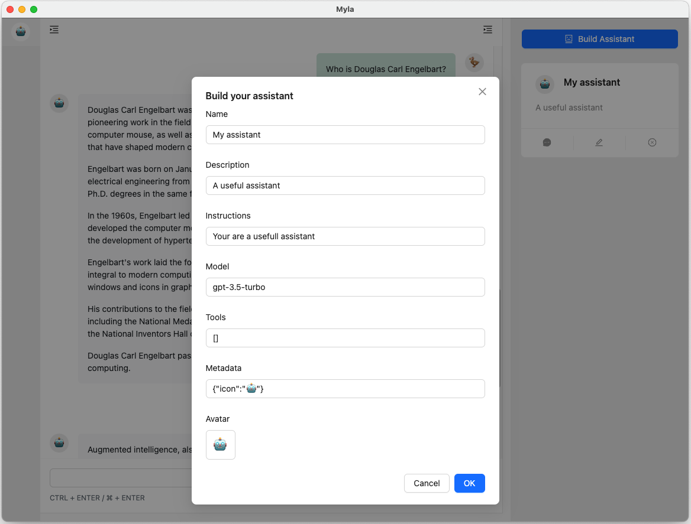

[English](README.md) | [简体中文](README_zh_CN.md)

# Myla: 私有化部署的 AI 助手 

## 私有化部署与 OpenAI 兼容的 AI 助手

Myla 取 MY Local Assistants 的含义，专为私有化部署基于大语言模型（LLM）的人工智能助手而设计和优化。Myla 提供与 **OpenAI assistants API** 兼容的 API，后端支持多种 LLM。无论是在笔记本上还是生产服务器上，都可以快速开发和运行人工智能助手。

## 快速入门
### 安装

Python 版本依赖: >= 3.9

Myla 可以通过 `pip` 从 PyPI 安装，推荐在安装前创建一个新的虚拟环境避免冲突。

```bash
pip install myla
```

### 配置

Myla 支持与 OpenAI API 兼容的 LLM 服务作为后端。你可以直接使用 OpenAI 的 API ，也可以部署自己的本地 LLM 。如果要部署本地 LLM ，建议使用 [Xorbits Inference](https://github.com/xorbitsai/inference)。

在当前目录创建 `.env` 文件，内容如下：

```
# LLM 配置
LLM_ENDPOINT=https://api.openai.com/v1/
LLM_API_KEY=sk-xx
DEFAULT_LLM_MODEL_NAME=gpt-3.5-turbo
```

更多配置请参考: [env-example.txt](env-example.txt)

#### 在本地运行 ChatGLM

Myla 支持以 `chatglm.cpp` 作为后端来运行 ChatGLM。需要安装 `chatglm.cpp` 的 Python Binding, 参考: https://github.com/li-plus/chatglm.cpp#python-binding 

`.env` 配置示例:

```
DEFAULT_LLM_MODEL_NAME=chatglm@/Users/shellc/Workspaces/chatglm.cpp/chatglm-ggml.bin
```

### 启动服务

```bash
myla
```

或者

```bash
python -m myla
```

查看更多启动参数:

```bash
myla --help
```

### WebUI

Myla 提供一个简易的 Web 界面, 方便开发调试 assistant。

从浏览器访问: http://localhost:2000/



### API

你可以直接使用 OpenAI 提供的 python SDK 来访问 Myla 的 API。

* API Docs: http://localhost:2000/api/docs
* Swagger: http://localhost:2000/api/swagger

## 社区

Myla 还在快速迭代中，欢迎参与社区贡献。
